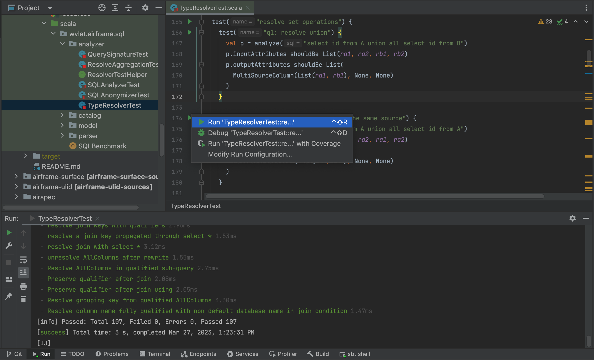

# IntelliJ plugin for AirSpec

Run [AirSpec](https://wvlet.org/airframe/docs/airspec) test cases on IntelliJ



## Build and Install

Build the plugin artifact by running the following command:

```shell
$ sbt clean package doPatchPluginXml packageArtifactZip
```

Then, you can install `target/intellij-airspec-<version>.zip` from the disk.
